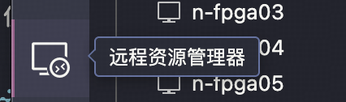
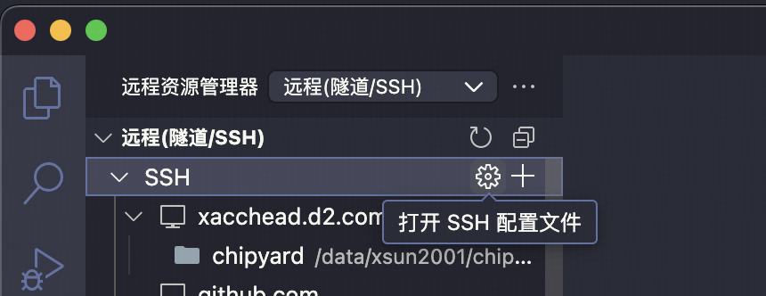
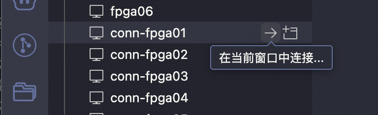
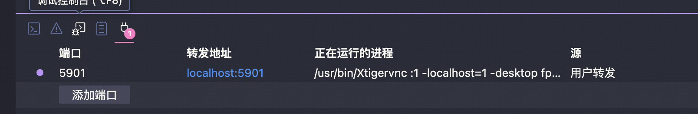
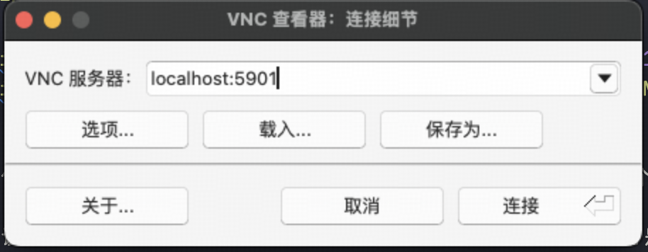
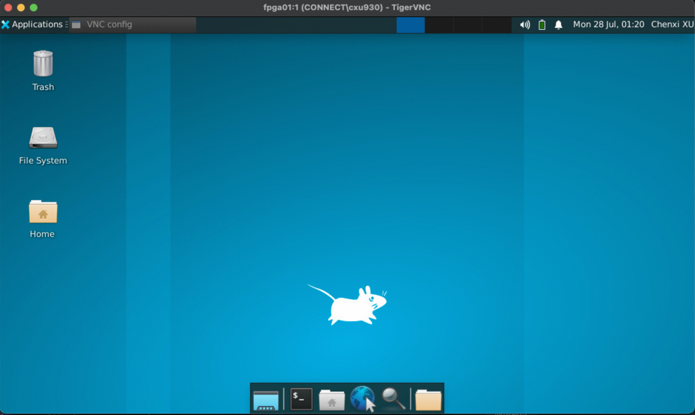
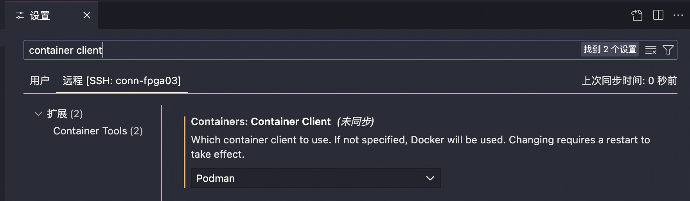
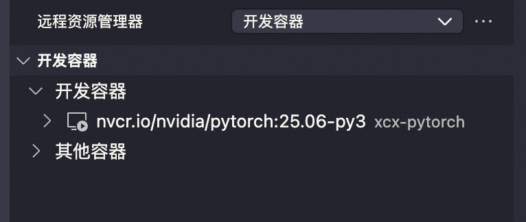
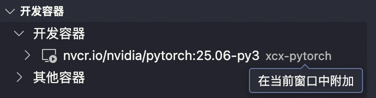

# 连接指南

本文档旨在引导您安全、高效地远程连接到服务器集群进行开发和计算工作。

## 1\. 通过 SSH 连接服务器

SSH (Secure Shell) 是连接到远程服务器最常用、最安全的方式。我们**强烈推荐**使用密钥对认证，而不是密码认证，因为它更安全、更便捷。

### 1.1. 生成 SSH 密钥对

首先，您需要在**您自己的本地电脑**上生成一个 SSH 密钥对（一个私钥，一个公钥）。

打开您本地电脑的终端 (Terminal) 或 PowerShell，运行以下命令：

```bash
# -t 指定加密算法为 ed25519 (更现代、更安全)
# -C "your_email@example.com" 是一个注释，方便您识别密钥
ssh-keygen -t ed25519 -C "your_email@example.com"
```

程序会提示您输入文件保存位置，直接按回车键 (Enter) 使用默认位置即可。通常是 `~/.ssh/id_ed25519` (私钥) 和 `~/.ssh/id_ed25519.pub` (公钥)。

### 1.2. 上传公钥到服务器

接下来，需要将您的**公钥** (`id_ed25519.pub`) 的内容添加到服务器上一个名为 `~/.ssh/authorized_keys` 的文件中。`ssh-copy-id` 命令可以自动完成这个过程。

在您**本地电脑**的终端中运行以下命令（替换为您的实际用户名和服务器地址）：

```bash
ssh-copy-id connect\\cxu930@10.92.254.204
```

::: tip
在Linux/MacOS下，`\`为Shell的转义字符，因此需要输入两个`\\`代表一个反斜杠。如果您在Windows上使用PowerShell或CMD，则只需输入一个反斜杠即可。
:::

如果使用不是默认的公钥路径，可以使用`-i <path to public key>`指定。成功后，您的公钥就被自动添加到了服务器的信任列表里。

::: tip
**备选方案**：如果您的本地电脑没有 `ssh-copy-id` 命令 (例如某些 Windows 版本)，可以手动复制：

1.  在本地电脑上，查看并复制公钥文件的内容 (`cat ~/.ssh/id_ed25519.pub`)。
2.  通过密码登录到远程服务器 (`ssh username@your_server_hostname`)。
3.  在服务器上，将您复制的公钥内容追加到 `~/.ssh/authorized_keys` 文件中 (`echo "公钥内容粘贴到这里" >> ~/.ssh/authorized_keys`)。请确保 `~/.ssh` 目录和 `authorized_keys` 文件的权限正确 (`chmod 700 ~/.ssh` 和 `chmod 600 ~/.ssh/authorized_keys`)。
:::

### 1.3. 使用私钥连接服务器

现在，您可以无需密码，直接通过私钥登录服务器了。

```bash
ssh username@your_server_hostname
```

如果您使用了非默认的私钥路径，使用`-i <path to private key>`指定。

为了简化连接，可以在本地电脑的 `~/.ssh/config` 文件中为服务器创建一个别名。

```text
# ~/.ssh/config 文件内容示例
Host fpga01
    HostName 10.92.254.204
    User connect\cxu930
    PreferredAuthentications publickey
    IdentityFile /Users/xsun2001/.ssh/id_hkustgz_clab_sv
```

配置后，您只需运行 `ssh fpga01` 即可登录。

因为用户主目录在所有服务器上都是共享的，因此只要复制一次公钥，所有服务器都能通过同一个私钥登录，上面的配置也可以复制六份分别表示六个服务器。

## 2\. 配置 VS Code 进行远程开发

VS Code 的 Remote - SSH 插件可以让您直接在本地 VS Code 编辑器中打开服务器上的文件夹，并获得完整的开发体验（终端、调试、Git等）。

### 2.1. 安装插件

在 VS Code 的插件市场中搜索并安装 **Remote - SSH** 插件。

### 2.2. 连接到服务器


安装 Remote - SSH 插件后，VS Code 左侧会出现远程资源管理器图标。


可以使用 VS Code 直接快速打开SSH配置文件并输入新的服务器连接信息。


在检测到的服务器列表中，点击即可在当前或新窗口中建立到远程服务器的连接。

现在，您可以通过 `文件 > 打开文件夹...` 来直接浏览和打开服务器上的项目目录，就和在本地工作完全相同。

## 3\. 使用 VNC 连接远程桌面

如果您需要图形用户界面 (GUI)，可以使用 VNC (Virtual Network Computing)。

**重要提示**：标准的 VNC 流量是**未加密**的，直接在公网上暴露 VNC 端口非常危险，我们强烈推荐使用 SSH 隧道来加密连接。VS Code的远程连接提供了方便的SSH端口映射功能，我们推荐使用这个方法。

首先，让VS Code连接到远程服务器上，然后开启终端，输入下面命令启动新的VNC服务器：

```bash
> vncserver 

You will require a password to access your desktops.

Password:
Verify:
Would you like to enter a view-only password (y/n)? n
A view-only password is not used

New Xtigervnc server 'fpga01:1 (CONNECT\cxu930)' on port 5901 for display :1.
Use xtigervncviewer -SecurityTypes VncAuth -passwd /home/CONNECT/cxu930/.vnc/passwd :1 to connect to the VNC server.
```

第一次使用会提示您设置一个专门用于 VNC 连接的密码。请记住这个密码。如果不小心忘记密码，请删除`~/.vnc/passwd` 文件，然后重新运行 `vncserver` 命令，它会提示你重新设置密码。

::: info
可以使用`-SecurityTypes None`选项来禁用密码，因为VNC流量已被SSH加密，具有一定的安全性，并更加方便。
:::

同时，该命令会创建一个新的桌面会话，并告诉您会话的编号，通常是 `:1` 或 `:2`。记下这个编号。这个编号对应的网络端口是 `5900 + 编号` (例如，`:1` 对应端口 `5901`)。



然后，像上图一样，配置一个SSH端口映射，将本地的5901端口映射到远程的5901端口（或其他VNC服务器所在的端口）。

::: tip
自然也可以手动配置 SSH 隧道：

```bash
# 将本地的 5901 端口流量，通过加密的 SSH，隧道转发到服务器的 5901 端口
ssh -L 5901:localhost:5901 username@your_server_hostname
```
:::

然后，使用任何一个VNC客户端（如 [RealVNC Viewer](https://www.realvnc.com/en/connect/download/viewer/) 或 [TigerVNC](https://tigervnc.org/)）连接到 `localhost:5901`，输入之前设置的 VNC 密码即可。





再使用完远程桌面后，可以关闭VNC服务器：

```bash
# -kill 后面跟上会话编号
vncserver -kill :1
```

## 4\. 在 VS Code 中连接到容器进行开发

如果您已经在服务器上使用 Docker 或 Podman 运行开发环境容器，VS Code 可以直接连接到容器内部，提供无缝的开发体验。

这个过程需要两步连接：`本地电脑 -> SSH -> 服务器 -> 容器`。

### 4.1. 前提条件

1.  您已经按照[第 2 节](https://www.google.com/search?q=%232-%E9%85%8D%E7%BD%AE-vs-code-%E8%BF%9B%E8%A1%8C%E8%BF%9C%E7%A8%8B%E5%BC%80%E5%8F%91)的方法，通过 VS Code 的 SSH 功能连接到了远程服务器。
2.  服务器上已经安装并运行了 Docker 或 Podman，并且您想连接的容器正在运行中。

### 4.2. 安装 Dev Containers 插件

在已经连接到远程服务器的 VS Code 窗口中，打开插件市场，搜索并安装 **Dev Containers** 插件。

> **注意**：您需要在远程服务器上安装此插件。VS Code 会自动提示您“在 SSH: your\_server\_hostname 上安装”。

如果你使用的是Podman，请更改远程主机的 **Containers: Container Client** 配置为`podman`，如下图所示：



### 4.3. 连接到正在运行的容器

在远程资源管理器中，选择开发容器：



找到想要连接的容器，选择 **在当前窗口附加** 或 **在新窗口附加**。如果找不到容器或不知道如何启动容器，可以先参考[Docker/Podman使用指南](./docker.md)。



现在，您的 VS Code 编辑器、终端、文件系统都完全在容器内部。您可以像在本地一样安装语言工具、运行调试器，而所有这一切都隔离在服务器的容器环境中。
