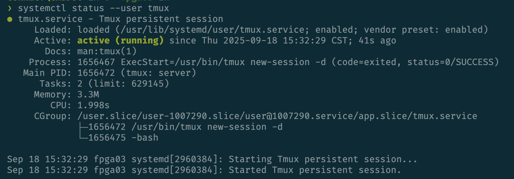

# 持久化Tmux

Tmux用于在后台执行用户进程，并提供了终端分屏等便捷操作。但是在FPGA服务器集群上，ssh会话登出之后，会终止所有用户进程，包括Tmux。本指南将会指导用户如何持久化Tmux会话，防止其终止。

## 启动用户Tmux服务

执行以下命令：

```bash
systemctl --user enable --now tmux
```

再执行以下命令查看`tmux`服务的状态：

```bash
systemctl --user status tmux
```

输入可能如下图所示：



如果出现`active (running)`，那么你的持久化Tmux会话就已经启动了。

## 启用用户进程逗留（Linger）

请用下面命令检查是否启用Linger (`<username>`是以`CONNECT\`开头的用户名):

```bash
loginctl show-user <username> -p Linger
```

如果输出为`Linger=no`，则没有启用。请联系管理员为你开启：

```bash
sudo loginctl enable-linger <username>
```

## 使用持久化Tmux

使用`tmux a`直接attach到自动创建的持久化tmux会话中，而不要直接用`tmux`新建会话，这样是不持久的。

如果你想创建新的session，可以先`tmux a`进入持久化会话，再用`ctrl-b`和`:new-session`命令创建新的会话。